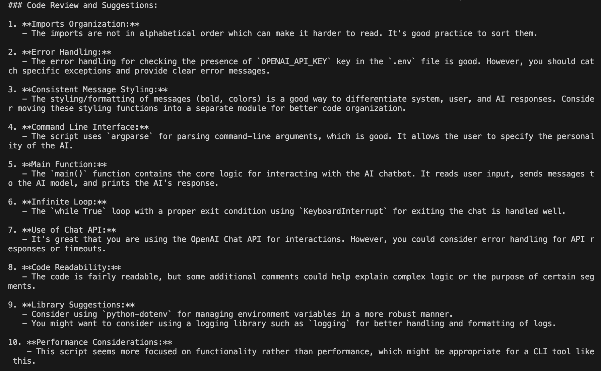

# basic-code-reviewer

Basic Command Line Reviewer project, using OpenAI's chosen LLMs. Results are printed in the terminal.

Example of reviewing `chatbot.py` file:

`python reviewer.py chatbot.py --model "gpt-4o"`

## How to run this project?

0. Prerequisites: 

    - Make sure Python3 is installed.
    - If you don't have an account with OpenAI, create one here: https://openai.com/
    - Create a project API key under Dashboard / API keys

1. Clone the project.

2. Create a virtual environment inside the project folder:

    `python -m venv venv`

3. Activate the virtual environment:

    Mac: `source venv/bin/activate`

    Windows: `venv\Scripts\activate`

4. Create an `.env` file in the root folder and add your project's API key:

    `OPENAI_API_KEY=your-unique-opanai-project-key`

5. Install the python dependencies:

    `pip install -r requirements.txt`

6. Run the project:

    - with default model (gpt-3.5-turbo): `python file-path/file-name.py`
    - with the model flag: `python file-path/file-name.py --model "gpt-4o"`

## Credit

This project was adopted from Colt Steele's Walkthrough project on Udemy: [Mastering OpenAI Python APIs](https://www.udemy.com/course/mastering-openai/?couponCode=24T3MT53024).

Changes made: API calls have been updated as per the latest documentation.
